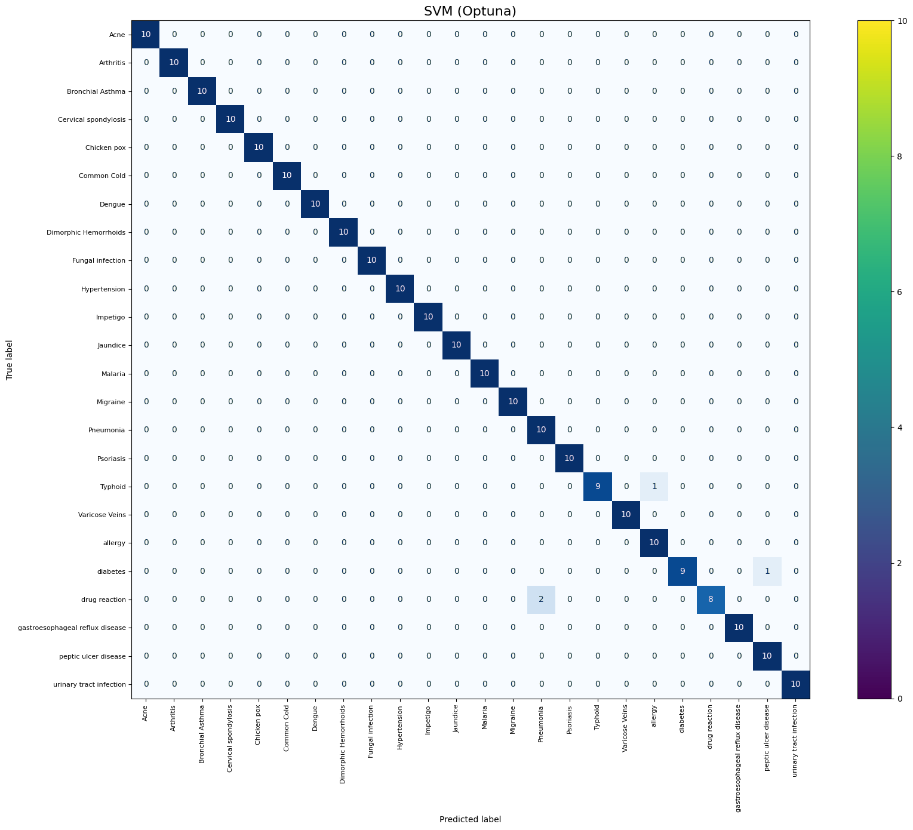

# Laporan Proyek Machine Learning - Raka Satria Efendi

## Domain Proyek
Penyakit yang tidak terdeteksi secara dini dapat memperburuk kondisi kesehatan pasien, terutama di daerah dengan akses terbatas ke tenaga medis. Menurut WHO (2023), keterlambatan diagnosis menyebabkan peningkatan angka kematian preventable hingga 35% di negara berkembang. Oleh karena itu, diperlukan sistem cerdas yang mampu memprediksi penyakit berdasarkan gejala dalam bentuk teks untuk mendukung diagnosis awal.

Proyek ini mengembangkan sistem klasifikasi penyakit berbasis Natural Language Processing (NLP) yang menganalisis deskripsi gejala untuk memprediksi penyakit secara akurat. Sistem ini memanfaatkan algoritma machine learning seperti Support Vector Machine (SVM), Logistic Regression, Naive Bayes, dan XGBoost untuk mengenali pola gejala dan menghubungkannya dengan label penyakit. Sistem ini berpotensi dikembangkan menjadi chatbot medis berbasis AI untuk mendukung self-diagnosis awal dan penyuluhan kesehatan.

**Referensi Pendukung:**
- WHO (2023) menyoroti pentingnya diagnosis dini.
- Jurnal seperti Dessi et al. (2021) dan Kalra et al. (2019) mendukung penggunaan TF-IDF dan SVM untuk klasifikasi teks medis.

## Business Understanding

### Problem Statements
1. Bagaimana mengembangkan sistem klasifikasi otomatis untuk memprediksi penyakit berdasarkan input teks gejala?
2. Algoritma machine learning atau NLP mana yang paling efektif untuk klasifikasi penyakit berbasis gejala tertulis?
3. Seberapa akurat sistem prediksi ini dalam membantu diagnosis awal berdasarkan gejala?

### Goals
1. Membangun sistem klasifikasi penyakit berbasis gejala teks.
2. Membandingkan performa model NLP dan memilih model terbaik berdasarkan metrik evaluasi.
3. Menyediakan solusi otomatis untuk membantu masyarakat dan tenaga kesehatan dalam diagnosis dini.

### Solution Statements
1. Menggunakan TF-IDF untuk merepresentasikan teks gejala dan menganalisis kontribusi kata penting terhadap klasifikasi.
2. Menerapkan dan membandingkan algoritma Logistic Regression, Naive Bayes, SVM, dan XGBoost, dengan hyperparameter tuning menggunakan Optuna untuk model terbaik.
3. Menganalisis hubungan semantik antar gejala untuk meningkatkan akurasi klasifikasi.

### Metodologi
Proyek ini bertujuan memprediksi penyakit berdasarkan deskripsi gejala menggunakan model klasifikasi NLP, dengan label penyakit sebagai target utama.

### Metrik
Metrik evaluasi meliputi:
- **Confusion Matrix**: Menampilkan True Positive (TP), False Positive (FP), True Negative (TN), dan False Negative (FN).
- **Akurasi**: Persentase prediksi benar dari total data.
- **Precision**: Ketepatan prediksi kelas positif.
- **Recall**: Kemampuan menangkap data positif.
- **F1-Score**: Rata-rata harmonik antara precision dan recall.

Metrik ini penting untuk mengevaluasi performa model, terutama pada dataset dengan distribusi kelas tidak seimbang.

## Data Understanding
Dataset diambil dari Kaggle, dipublikasikan oleh niyarrbarman ([link dataset](https://www.kaggle.com/datasets/niyarrbarman/symptom2disease)). Dataset ini berisi 1200 entri dengan dua kolom utama:
- **Unnamed: 0**: Fitur ini merupakan indeks atau kolom default yang dihasilkan saat dataset dimuat, kemungkinan berfungsi sebagai identifier baris unik. Namun, fitur ini tidak memiliki makna klinis atau relevansi langsung dengan prediksi penyakit, sehingga akan dievaluasi untuk penghapusan pada tahap preprocessing.
- **label**: Nama penyakit (24 kelas, seperti Diabetes, Psoriasis, dll.).
- **text**: Deskripsi gejala dalam teks.

### Exploratory Data Analysis (EDA)
- **Distribusi Kelas**: 
    
     

    menunjukkan distribusi kelas yang cukup seimbang.

- **Analisis Gejala**: 
    
    

    menunjukkan kata-kata kunci seperti "skin", "lotfeel", dan "experience" yang sering muncul.

- **Jumlah Kelas**: 24 penyakit unik diidentifikasi, dengan beberapa penyakit memiliki gejala tumpang tindih (misalnya, GERD dan Peptic Ulcer).

### Data Quality Verification
- **Duplikat**: Tidak ada data duplikat ditemukan.
- **Missing Value**: Tidak ada nilai hilang pada kolom teks dan label.
- **Outlier**: Ditemukan sejumlah outlier berdasarkan analisis distribusi:
  - Sebanyak **17 outlier** pada kolom `text_length`, seperti ID: [261, 265, 264, ...].
  - Sebanyak **12 outlier** pada kolom `word_count`, seperti ID: [50, 53, 49, ...].
  
  Meskipun ditemukan, outlier ini masih mencerminkan variasi alami dari panjang ulasan dan jumlah kata. Oleh karena itu, **tidak dilakukan penghapusan** karena informasi dalam teks tetap relevan dan representatif.

## Data Preparation

### Penghapusan Kolom 'Unnamed: 0'
- Kolom 'Unnamed: 0', yang merupakan indeks default dari dataset awal, dihapus karena tidak memiliki nilai prediktif tambahan dan hanya berfungsi sebagai identifier baris. Langkah ini dilakukan untuk menghindari noise dalam proses pelatihan model.

### Label Encoding
- Label penyakit dikonversi ke format numerik menggunakan **LabelEncoder** dari `sklearn`.
- Proses ini memungkinkan algoritma machine learning untuk memproses target variabel dengan 24 kelas unik.
- Mapping label dapat dilihat sebagai contoh: Acne = 0, Arthritis = 1, dst.

### TF-IDF Vectorization
- Teks gejala pasien diubah menjadi representasi numerik menggunakan **TF-IDF Vectorizer** dengan 1000 fitur maksimum.
- TF-IDF digunakan karena dapat memberi bobot penting pada kata-kata unik dan relevan dari setiap dokumen.

### Fitur Tambahan: Panjang Teks dan Jumlah Kata
- Dua fitur tambahan dibuat dari kolom teks:
  - `text_length`: jumlah karakter dalam teks.
  - `word_count`: jumlah kata dalam teks.
- Fitur ini digunakan untuk menambah informasi numerik non-kontekstual yang mungkin berpengaruh terhadap prediksi.

### Penggabungan Fitur
- Fitur teks hasil **TF-IDF** (sparse matrix) digabungkan dengan fitur numerik `text_length` dan `word_count` (dense array) menggunakan `hstack`.

### Data Splitting
- Dataset dibagi menjadi data latih (80%) dan data uji (20%) menggunakan `train_test_split` dengan **stratifikasi** berdasarkan label untuk mempertahankan proporsi kelas.

### Normalisasi ( Fitur Numerik )
- Fitur `text_length` dan `word_count` dinormalisasi menggunakan **MinMaxScaler** agar memiliki skala yang seragam (0–1).
- Langkah ini penting karena TF-IDF sudah memiliki skala kecil (0–1), dan tanpa normalisasi, fitur numerik bisa mendominasi proses pembelajaran model.

### Catatan Tambahan:
- **Text cleaning dan stemming tidak dilakukan** pada tahap ini. Pendekatan yang dipilih fokus pada representasi teks asli agar informasi konteks tetap terjaga dalam ekstraksi TF-IDF.

## Modeling

Pada tahap ini, empat algoritma machine learning digunakan untuk mengklasifikasikan penyakit berdasarkan gejala dalam bentuk teks: **Support Vector Machine (SVM)**, **Logistic Regression**, **Multinomial Naive Bayes**, dan **XGBoost**. Setiap algoritma dioptimasi menggunakan **Optuna** untuk hyperparameter tuning guna mencapai performa terbaik. Berikut adalah penjelasan mekanisme dasar, parameter yang digunakan, serta kelebihan dan kekurangan masing-masing algoritma.

### 1. Support Vector Machine (SVM)

- **Mekanisme Dasar**: SVM mencari *hyperplane* optimal yang memisahkan kelas-kelas data dengan margin maksimum dalam ruang fitur berdimensi tinggi menggunakan kernel. Dalam proyek ini, `LinearSVC` digunakan karena cocok untuk data teks berdimensi tinggi seperti hasil TF-IDF.
- **Parameter yang digunakan**:
  - `C`: 6.716 (hasil tuning Optuna, mengontrol trade-off antara margin dan penalti kesalahan).
  - `max_iter`: 5000
  - `dual`: False
  - `random_state`: 42
- **Kelebihan**:
  - Efektif untuk data berdimensi tinggi.
  - Robust terhadap noise.
- **Kekurangan**:
  - Sensitif terhadap parameter.
  - Risiko overfitting jika tuning tidak tepat.
- **Akurasi**: **98%**

### 2. Logistic Regression

- **Mekanisme Dasar**: Logistic Regression memprediksi probabilitas kelas menggunakan fungsi sigmoid dan mengoptimalkan log-loss untuk memisahkan kelas.
- **Parameter yang digunakan**:
  - `C`: 9.961 (hasil tuning Optuna).
  - `penalty`: `'l2'`
  - `solver`: `'liblinear'`
  - `max_iter`: 1000
  - `random_state`: 42
- **Kelebihan**:
  - Sederhana dan mudah diinterpretasi.
  - Cocok untuk hubungan linear antara fitur dan target.
- **Kekurangan**:
  - Kurang efektif pada pola non-linear yang kompleks.
- **Akurasi**: **98%**

### 3. Multinomial Naive Bayes

- **Mekanisme Dasar**: Menghitung probabilitas kelas berdasarkan distribusi fitur teks dengan asumsi independensi antar fitur. Cocok untuk data TF-IDF.
- **Parameter yang digunakan**:
  - `alpha`: 1.0 (smoothing parameter)
- **Kelebihan**:
  - Cepat dan efisien untuk klasifikasi teks.
- **Kekurangan**:
  - Asumsi independensi fitur menyebabkan performa menurun bila fitur saling bergantung.
- **Akurasi**: **92%**

### 4. XGBoost

- **Mekanisme Dasar**: Membangun pohon keputusan secara berurutan menggunakan gradient boosting dan regularisasi.
- **Parameter yang digunakan**:
  - `n_estimators`: 284
  - `max_depth`: 7
  - `learning_rate`: 0.0448
  - `subsample`: 0.6077
  - `colsample_bytree`: 0.6128
  - `use_label_encoder`: False
  - `eval_metric`: `'mlogloss'`
  - `random_state`: 42
- **Kelebihan**:
  - Mampu menangani data kompleks dengan banyak fitur.
  - Mendukung regularisasi untuk menghindari overfitting.
- **Kekurangan**:
  - Berisiko kesalahan klasifikasi silang antar kelas jika tuning kurang optimal.
- **Akurasi**: **91%**

### Proses Hyperparameter Tuning

Tuning dilakukan menggunakan **Optuna**, sebuah library otomatisasi pencarian hyperparameter. Setiap algoritma dijalankan sebanyak **20 trial**:

- **SVM**: Tuning `C` dari 1e-3 hingga 10.0.
- **Logistic Regression**: Tuning `C` (1e-3 hingga 10.0) dan `penalty` (`l1`, `l2`).
- **XGBoost**: Tuning `n_estimators`, `max_depth`, `learning_rate`, `subsample`, dan `colsample_bytree`.

### Pemilihan Model Terbaik

Dari keempat model yang diuji, **Support Vector Machine (SVM)** dipilih sebagai model terbaik berdasarkan hasil berikut:

- **Akurasi Tertinggi**: 98% pada data uji.
- **Konsistensi Klasifikasi**: Mengklasifikasikan dengan benar 22 dari 24 kelas penyakit.
- **Stabilitas**: Performa stabil tanpa overfitting, khususnya pada kelas-kelas dengan distribusi data tidak seimbang.

Dengan kombinasi TF-IDF dan fitur numerik seperti `text_length` dan `word_count`, SVM mampu menangkap pola penting dari gejala penyakit berbasis teks dan memberikan prediksi yang sangat akurat.

## Evaluation

### Metrik Evaluasi

* **Confusion Matrix**:
  
  Menunjukkan klasifikasi sempurna pada 21 dari 24 penyakit berdasarkan model SVM.

* **Classification Report**:

  

  Menunjukkan nilai evaluasi sebagai berikut untuk SVM:

  * **Accuracy**: 98%
  * **F1-score**: 98%
  * **Precision**: 99%
  * **Recall**: 98%

* **Cross-Validation**:
  Rata-rata akurasi **5-fold cross-validation** untuk model SVM adalah **98.23%**, menunjukkan kestabilan performa di berbagai subset data.

### Studi Kasus

* **Input Gejala**:
  `"increased thirst and hunger, frequent urination, unexplained weight loss, blurred vision, slow healing wounds"`
* **Prediksi**:
  `Diabetes` (sesuai label aktual)
* **Interpretasi**:
  Sistem berhasil mengenali pola gejala dengan akurat, menunjukkan potensi kuat dalam diagnosis awal penyakit berbasis teks.

### Insight Perbandingan Performa Model Berdasarkan Metrik

* **SVM (Optuna)** dan **Logistic Regression (Optuna)** unggul di hampir semua metrik.

  * **SVM Akurasi**: 98.33% | F1: 98.32% | Precision: 98.55% | Recall: 98.33%
  * **LogReg Akurasi**: 97.92% | F1: 97.91% | Precision: 98.17% | Recall: 97.92%
* **Multinomial Naive Bayes**:

  * Akurasi: 92.08% | F1: 91.67% | Precision: 93.48% | Recall: 92.08%
* **XGBoost (Optuna)**:

  * Akurasi: 90.83% | F1: 90.75% | Precision: 91.40% | Recall: 90.83%

### Kesimpulan

1. **Sistem Klasifikasi**:
   Sistem NLP berbasis SVM mampu memprediksi penyakit dengan akurasi **98.33%** berdasarkan gejala teks, serta performa terbaik di semua metrik utama.

2. **Algoritma Terbaik**:
   SVM dengan tuning Optuna menjadi model terbaik karena performa konsisten, akurasi tinggi, dan stabilitas pada banyak kelas penyakit.

3. **Dampak Klinis**:
   Sistem ini sangat potensial untuk digunakan sebagai alat diagnosis awal, terutama di daerah dengan keterbatasan akses ke tenaga medis, namun tetap memerlukan verifikasi dari profesional medis.

## Referensi
1. Dessi, D., Helaoui, R., Kumar, V., Recupero, D. R., & Riboni, D. (2021). TF-IDF vs word embeddings for morbidity identification in clinical notes: An initial study. *arXiv*. https://arxiv.org/abs/2105.09632
2. Kalra, S., Li, L., & Tizhoosh, H. R. (2019). Automatic classification of pathology reports using TF-IDF features. *arXiv*. https://arxiv.org/abs/1903.07406
3. Lai, L.-H., Lin, Y.-L., Liu, Y.-H., Lai, J.-P., Yang, W.-C., Hou, H.-P., & Pai, P.-F. (2024). The use of machine learning models with Optuna in disease prediction. *Electronics, 13*(23), 4775. https://doi.org/10.3390/electronics13234775
4. Rudd, J. M. (2017). Application of support vector machine modeling and graph theory metrics for disease classification. *arXiv*. https://arxiv.org/abs/1708.00122
